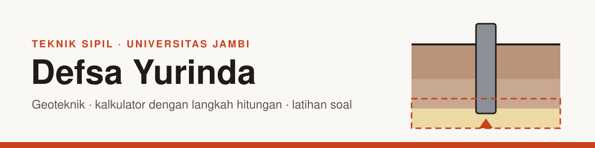

<picture>
  <source media="(prefers-color-scheme: dark)" srcset="assets/banner-gelap.svg">
  
</picture>

Mahasiswa Teknik Sipil di Universitas Jambi, dengan minat utama geoteknik. Saya membuat alat hitung dan latihan soal geoteknik yang bisa dipakai siapa saja, dan mencatat cara saya belajar bersama Claude Code.

**[Buka situs →](https://defsayurinda-bot.github.io/Defsa-Yurinda/)**

### Alat

<!-- ALAT:MULAI -->
| Alat | Isi |
|---|---|
| [Kalkulator Penurunan Konsolidasi](https://defsayurinda-bot.github.io/Defsa-Yurinda/kalkulator/konsolidasi.html) | Hitung penurunan konsolidasi primer satu dimensi untuk lempung NC dan OC beserta lajunya terhadap waktu, lengkap dengan diagram e–log σ' dan langkah hitungan. |
| [Kalkulator Pondasi Dangkal](https://defsayurinda-bot.github.io/Defsa-Yurinda/kalkulator/pondasi-dangkal.html) | Hitung kapasitas dukung pondasi dangkal dengan persamaan daya dukung umum: faktor bentuk, kedalaman, dan koreksi muka air tanah, lengkap dengan langkah hitungan. |
| [Kalkulator Tiang Bor N-SPT](https://defsayurinda-bot.github.io/Defsa-Yurinda/kalkulator/tiang-bor.html) | Hitung daya dukung aksial tiang bor dari data N-SPT dengan metode Reese & Wright (1977) dan Meyerhof (1976), lengkap dengan langkah hitungan. |
| [Latihan Soal Geoteknik](https://defsayurinda-bot.github.io/Defsa-Yurinda/latihan/) | Latihan soal geoteknik dengan angka acak dan pembahasan langkah demi langkah: pondasi dangkal, konsolidasi, dan tiang bor. |
<!-- ALAT:SELESAI -->

Setiap hitungan diuji otomatis terhadap perhitungan Python terpisah dan nilai tabel buku teks.

### Catatan belajar

<!-- CATATAN:MULAI -->
- **02** · [Git dan Pull Request pertama](https://github.com/defsayurinda-bot/Defsa-Yurinda/blob/main/catatan/02-git-dan-pull-request-pertama.md)
- **01** · [Mengenal Claude dan Claude Code](https://github.com/defsayurinda-bot/Defsa-Yurinda/blob/main/catatan/01-mengenal-claude-dan-claude-code.md)
<!-- CATATAN:SELESAI -->

### Aktivitas terbaru

<!-- AKTIVITAS:MULAI -->
- 25 Sep 2026 · [Tambah bank soal latihan geoteknik](https://github.com/defsayurinda-bot/Defsa-Yurinda/commit/3d37e56447b0e45409d7e010984ac095ba8b60aa)
- 25 Sep 2026 · [Tambah kalkulator pondasi dangkal dan penurunan konsolidasi](https://github.com/defsayurinda-bot/Defsa-Yurinda/commit/86ef7f1561df8fa94455ac90244b6e7322b1b4cd)
- 25 Sep 2026 · [Tambah situs dan kalkulator daya dukung tiang bor N-SPT](https://github.com/defsayurinda-bot/Defsa-Yurinda/commit/96712d5b93a378ef3e0ba63a544a3349ea6410a6)
- 25 Sep 2026 · [Tambah CLAUDE.md berisi aturan isi repo publik](https://github.com/defsayurinda-bot/Defsa-Yurinda/commit/92e9736fb6e5c02627e6229442d4609f04360754)
- 25 Sep 2026 · [Isi awal: profil, catatan belajar, cara memakai Claude, skill, lisensi](https://github.com/defsayurinda-bot/Defsa-Yurinda/commit/d09a7a79142a0e97c5119e9cf9aaa46c44d7dddf)
<!-- AKTIVITAS:SELESAI -->

### Tentang

- Sedang mengerjakan: tugas akhir tentang daya dukung fondasi tiang bor
- Perangkat lunak: Word, Excel, PowerPoint, AutoCAD, Revit; dasar ETABS, SAP2000, PLAXIS
- Sedang belajar: Git, GitHub, Claude Code
- Cara saya memakai AI untuk kuliah: [preferensi](https://github.com/defsayurinda-bot/Defsa-Yurinda/blob/main/cara-saya-memakai-claude/preferensi.md) · [batasan dan etika](https://github.com/defsayurinda-bot/Defsa-Yurinda/blob/main/cara-saya-memakai-claude/batasan-dan-etika.md)

Bagian alat, catatan, dan aktivitas diperbarui otomatis setiap hari oleh GitHub Actions dari repo [Defsa-Yurinda](https://github.com/defsayurinda-bot/Defsa-Yurinda).
